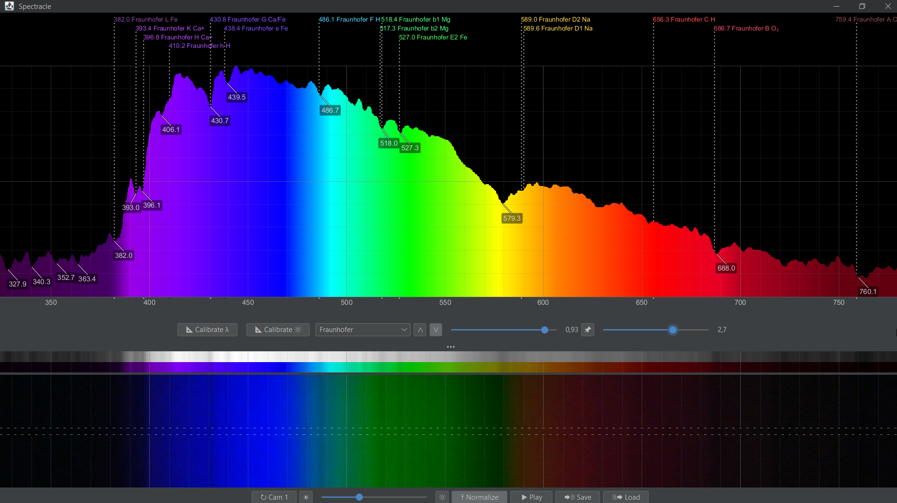
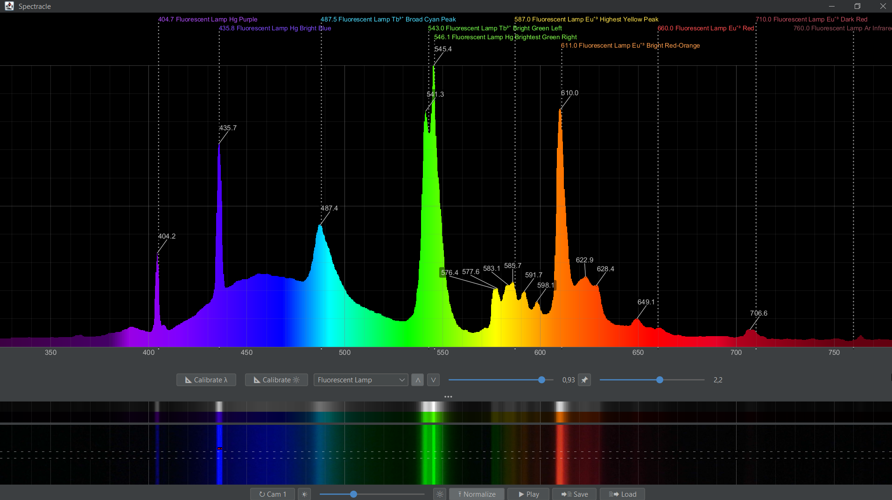
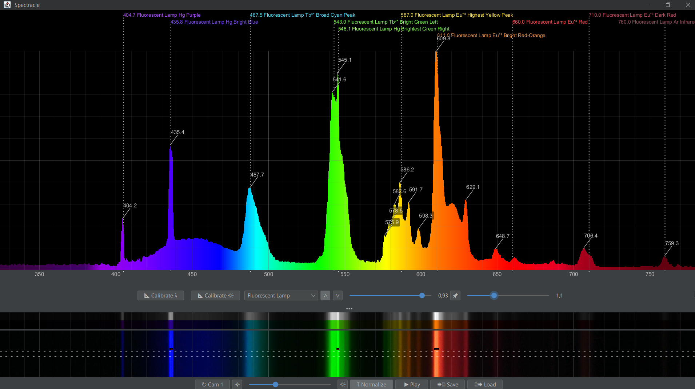
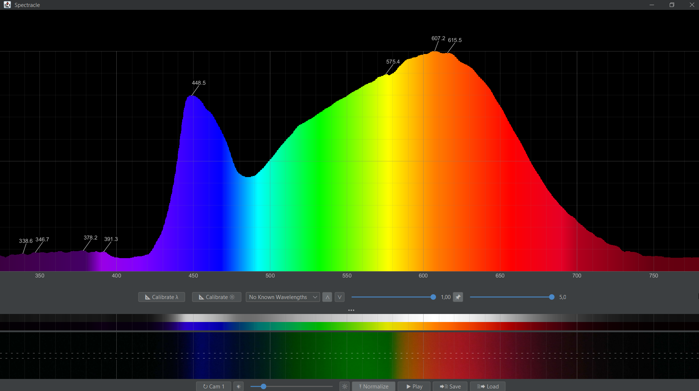
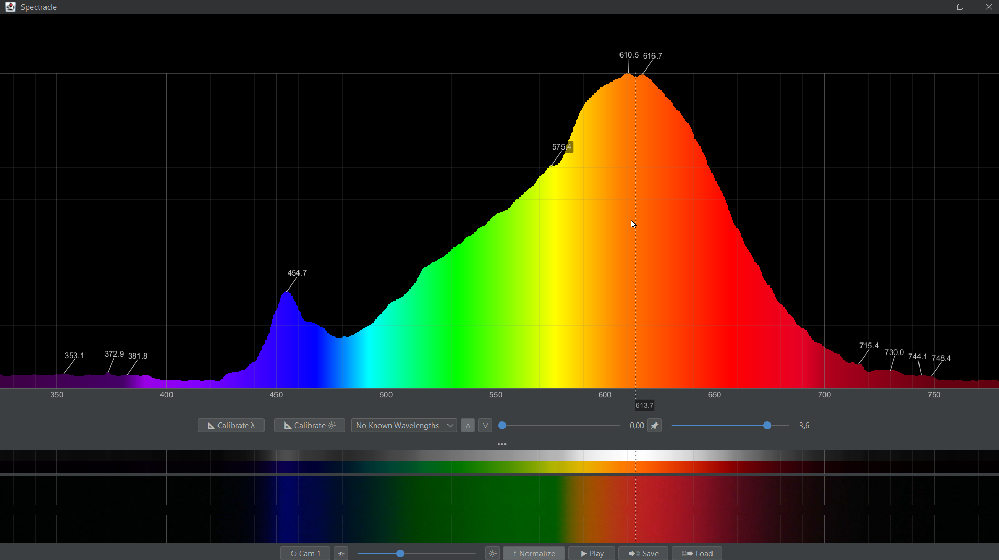
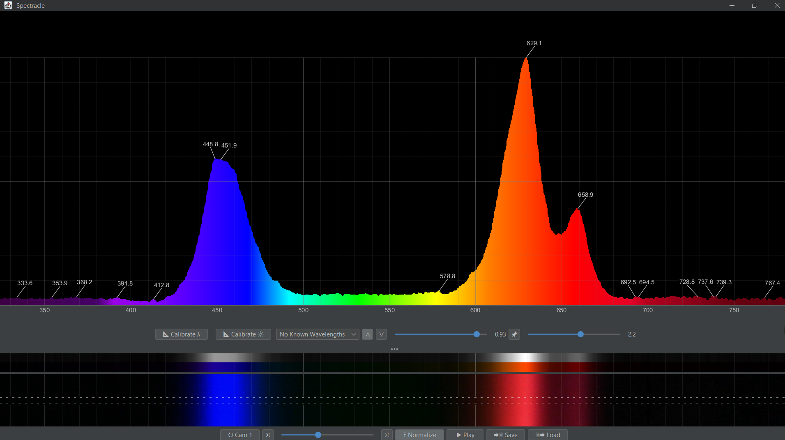

# Spectracle – a Spectrometer UI for Computer Attached Cameras

### WORK IN PROGRESS!

This app samples the spectrum from the video stream of a computer attached camera that captures a spectrum from a
spectroscope or grid or prisma horizontally.

## Examples

### Blue Sky with Fraunhofer Lines

### Ordinary Fluorescent Lamp

### High Quality Fluorescent Daylight Lamp

### Desktop LED Lamp with Good Light

### Retro LED Lamp

### Pinkish Plant LED Panel

## Current Features

* Colored spectrum graph view
* Camera image view
* Two-point wavelength calibration
* Sensitivity calibration by comparing a captured spectrum with a known reference spectrum of an incandescent lamp or a
  halogen lamp
* Known wavelengths display:
  * Fraunhofer lines of the sun spectrum
  * Wavelengths of fluorescent tubes
* Peak and dent detection with wavelength display
* Time averaging
* Peak hold, combinable with time averaging for peak decay
* Gaussian smoothing for noise reduction
* Manual exposure control
* Play/Stop
* Saving and loading of captured spectra as CSV

## Hardware

TODO: USB camera module with OV2710 sensor, 16 mm lens, hand spectroscope, mounting 3D printed, ...
