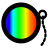

#  Spectracle – a Spectrometer UI for Computer Attached Cameras

Yet another light spectroscope UI. This app samples the spectrum from the video stream of a computer attached camera with an
attached spectroscope. It has been inspired by the great work from Youtube channel Les' Lab and some other great
youtubers.

## Installation

Pre-built installers for Windows amd64 (MSI) and Linux amd64 (DEB) are available as artifacts in the workflow builds in [Actions](https://github.com/grillbaer/spectracle/actions). There are no tagged release versions yet. The installers already contain the required JRE. They install the application including the JRE in `Program Files\Spectracle` (Win) resp. `/usr/lib/spectracle` with executable `/usr/bin/Spectracle` (Linux) and add shortcuts to the start menu. They do not touch or require any system wide JRE installations.

## Basic Usage

The window shows the middle stripe of the camera picture at the bottom and the spectral intensity graph sampled from it at the top. Both are scaled to full width:

### Wavelength Calibration

Before getting correct wavelength readings, you must calibrate your spectroscope and camera setup with the aid of a known light source.
You can either use the known spectral lines of a simple fluorescent lamp/tube, the dark Fraunhofer lines of natural daylight (if your setup has good resolution) or any other known wavelengths in light sources.

Simply enter wavelength calibration mode, select the known wavelengths in ascending or descending order in the text fields / dropdown boxes and drag the cursors in the spectrum graph to the corresponding peaks or dents. Either apply or abort the calibration.

There must be at least 2 calibration points, but you can use more to get better precision for the usually not exactly linear spectroscopes. Well distributed calibration points with enough distance will yield better results.

My simple hardware setup at the bottom of this page is able to get to below 1 or 2 nm precision in most ranges.

### Sensitivity Calibration

The sensitivity of most cameras highly depends on wavelength. This is especially true for the cheap RGB cams with their color filters. Monochrome would be better. The spectrum therefore cannot be used to compare intensities over a larger wavelength range unless it is calibrated.

For a rough calibration you can use the glow emission spectrum of a halogen or incandescent lamp. Spectracle can calculate a sensitivity correction curve by comparing the measured spectrum to the theoretical spectrum of a black body with a matching temperature.

A white diffuser between the light bulb's glow wire and spectroscope, the peak hold and the stop function may help to get a good capture of the full spectrum with a low noise level. (Some additional smoothing to the spectrum will be applied by Spectracle internally, anyway.)
Watch out not to have any overexposure in the spectrum!

Yet uncalibrated:

Already calibrated, shows the current sensitivity correction curve:

Only the range from 380 to 750 nm will be considered for calibration because many cams are very insensitive in UV and IR which would cause a lot of noise in the visible range of the spectrum as a result.

## Examples

### Blue Sky with Fraunhofer Lines

### Ordinary Fluorescent Lamp

### High Quality Fluorescent Daylight Lamp

### Desktop LED Lamp with Good Light

### Retro LED Lamp

### Black Light Pocket Lamp

LED-based black light pocket lamp with 395 nm according to manufacturer. Also has an intense IR peak at 770 nm:

### Pinkish Plant LED Panel

### Daylight Through a Green Plant Leaf

A leaf of sorrel:

### Flash in Thunderstorm

A flash captured in a nightly thunderstorm using peak hold. Spectrum is quite noisy
because camera needed a high exposure setting.
Clearly shows peaks from nitrogen and oxygen (air) and also hydrogen (rain):

## Current Features

* Colored spectrum graph view
* Camera image view
* Wavelength calibration with at least 2 and up to 5 known reference points, linear interpolation
* Sensitivity calibration by comparing a captured spectrum with a known reference spectrum of an incandescent lamp or a
  halogen lamp
* Known wavelengths display:
    * Fraunhofer lines of the sun spectrum
    * Wavelengths of fluorescent tubes
* Peak and dent detection with wavelength display
* Time averaging
* Peak hold, combinable with time averaging for peak decay
* Gaussian smoothing for noise reduction
* Manual exposure control
* Overexposure visualization
* Play/Stop
* Saving and loading of captured spectra as CSV

## Hardware

The setup uses

* a Paton Hawksley benchtop spectroscope
* an ELP 1080P USB web cam with OV2710 1/2.7" color CMOS sensor
* a lens with 12 mm focal length, without IR filter, ⌀ 12mm thread.

The setup is far from optimal. The spectroscope itself is great. However, a RGB camera causes some problems in a
spectrometer due to the inconsistent sensitivity over the spectrum. So, the camera shows some false peaks or dents in
the spectrum depending on light intensity for yellow colors around 580 nm, just at the transition between green and red
filter. Camera and lens are quite cheap. The 12 mm thread is wobbely, I don't know which side is missing precision.
The lens thread used with this camera is also almost too short to focus to infinity, so that some separate holder is
required to stabilize the setup. The imprecise USB plug of my received item lost connection every now and then at least
in my notebook. Soldering a new plug fixed this. But hey, that's what to expect for that price.

This is the 3D printed fixture I use at the moment:

* [Spectroscope Camera Fixture @ onshape.com](https://cad.onshape.com/documents/067b9cbbfe91eaae340bbdb7/w/bf45124c7a9fedfbfbcc2b60/e/39af0ef3fc2ecf463972dfda)
* [STL file](hardware/fixture-v6.stl)

